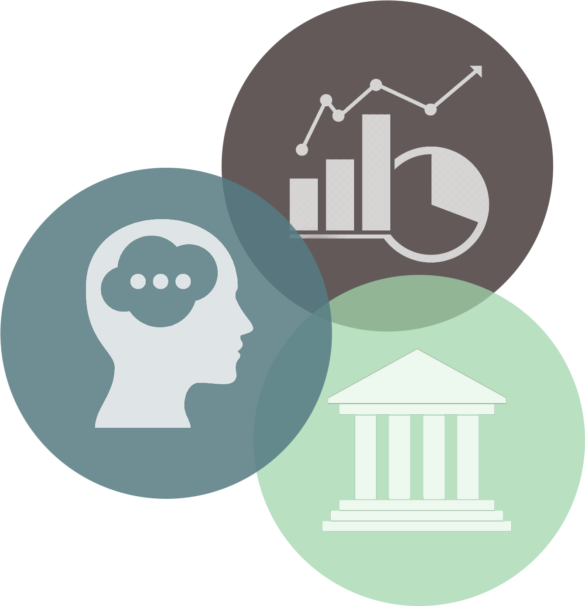

# Applied Data Science @ Columbia
## Fall 2021
## Project 1: A "data story" on the history of philosophy



[Image Source](https://www.pinclipart.com/pindetail/mTxwRo_philosopher-clipart-transparent-png-download/)

### [Project Description](doc/)
This is the first and only *individual* (as opposed to *team*) project this semester. 

Term: Fall 2021

+ Project title: Words, Words, Words
+ This project is conducted by Emily Jennings-Dobbs

+ Project summary: The way philosophers talk and write has confused countless people for generations, myself included. Well, if you can't beat them, join them. Have you ever wanted to confuse people the way Aristotle and Plato have for generations? Well now you can! With this analysis we'll try to dissect the essence of word choice in philosophical text and really determine how to speak like a Philosophical writer. 

Following [suggestions](http://nicercode.github.io/blog/2013-04-05-projects/) by [RICH FITZJOHN](http://nicercode.github.io/about/#Team) (@richfitz). This folder is orgarnized as follows.

```
proj/
├── lib/
├── data/
├── doc/
├── figs/
└── output/
```

Please see each subfolder for a README file.
